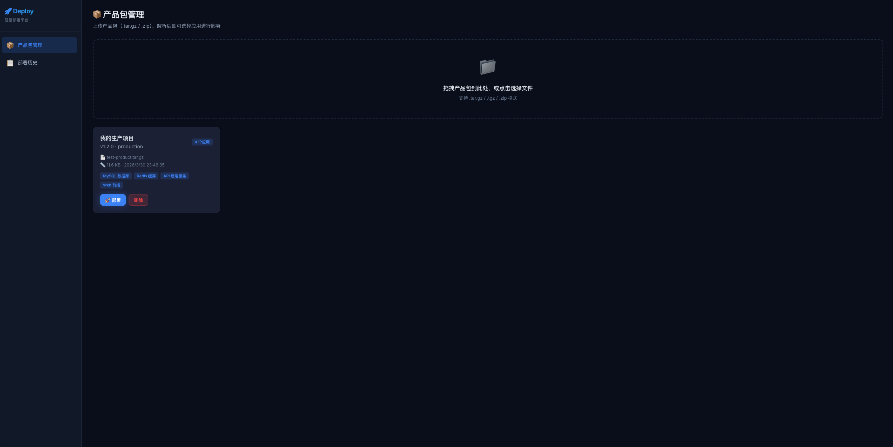
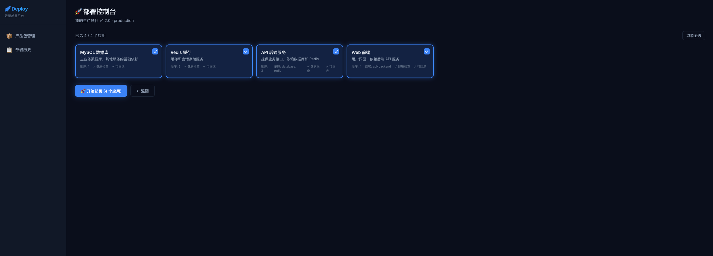
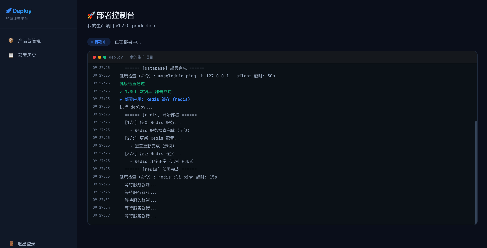
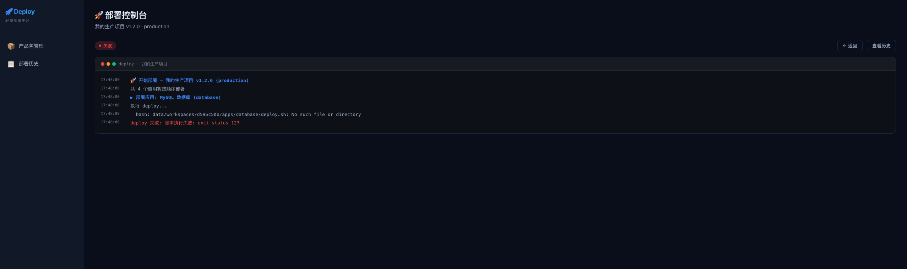

# 项目发布与可视化部署系统 (Deploy System)

> 一个轻量、灵活、双模式支持的应用部署与发布管理系统。包含 **CLI 交互式部署终端 (Deploy Standalone)** 与 **Web 可视化部署平台 (Deploy Platform)**。

本系统旨在解决中小型项目在单机环境下的自动化发布痛点，支持多应用选择、拓扑依赖管理、生命周期钩子、三级健康检查和逆序自动回滚。

---

## 🛠️ 系统双模式概览

本仓库包含两种使用模式，满足不同场景下的发布需求：

```
                              ┌────────────────────────────────────────┐
                              │          应用发布包 (App Tarball)       │
                              │  (apps.json + deploy.sh + apps 脚本等) │
                              └───────────────────┬────────────────────┘
                                                  │
                         ┌────────────────────────┴────────────────────────┐
                         ▼                                                 ▼
        【 CLI 交互式部署终端 】                                 【 Web 可视化部署平台 】
      (Deploy Standalone - 纯 Bash)                          (Deploy Platform - Go + Vue3)
 ┌───────────────────────────────────────┐               ┌───────────────────────────────────────┐
 │ • 零额外依赖 (Bash + jq + curl)       │               │ • 浏览器可视化交互，拖拽上传发布包      │
 │ • 适用于服务器 SSH 终端直接操作       │               │ • 实时终端日志推送 (WebSocket)         │
 │ • 本地配置文件驱动，极速响应          │               │ • 历史部署任务记录、失败一键回滚       │
 │ • 命令行参数，适合 CI/CD 自动化集成   │               │ • Go 语言后端（零数据库），Vue 3 前端   │
 └───────────────────────────────────────┘               └───────────────────────────────────────┘
```

---

## 🚀 快速开始

### 模式 A：CLI 交互式部署终端 (Deploy Standalone)

该模式直接运行在服务器终端上，使用交互式菜单选择应用进行部署。

#### 1. 安装环境依赖
*   **macOS**: `brew install jq curl`
*   **Ubuntu / Debian**: `apt-get install -y jq curl`
*   **CentOS / RHEL**: `yum install -y jq curl`

#### 2. 初始化项目权限
```bash
# 进入项目根目录并赋予脚本执行权限
chmod +x shell/init.sh scripts/*.sh apps/**/*.sh
```

#### 3. 运行部署
```bash
./shell/init.sh
# 或者指定自定义配置文件路径
./shell/init.sh --config config/apps.json
```

---

### 模式 B：Web 可视化部署平台 (Deploy Platform)

该模式提供了一个基于浏览器的后台管理系统，支持上传产品包并在网页端一键执行部署、回滚和日志查阅。

#### 1. 开发模式启动

##### 后端 (Go)
```bash
cd src/platform/backend
go mod tidy
go run main.go # 默认启动于 9090 端口，数据保存在 ./data
```

##### 前端 (Vue 3)
```bash
cd src/platform/frontend
npm install
npm run dev # 默认启动于 3000 端口，自动代理 API 请求至 9090
```
*打开浏览器访问 `http://localhost:3000` 即可开始使用。*

#### 2. 生产环境部署 (编译打包)

你可以使用 Makefile 快速完成前后端的编译与整合：
```bash
cd src/platform
make build # 一键编译前端静态文件并编译 Go 后端二进制程序
```
构建完成后，所有的运行物会整合至 `src/platform/release/` 下：
```bash
cd src/platform/release
./start.sh # 运行部署平台服务（默认端口 9090）
```
*在浏览器中直接访问 `http://localhost:9090`。*

#### 3. 界面预览

**产品包管理** — 拖拽上传产品包，解析后可部署或删除：



**部署控制台** — 勾选应用并一键部署：



**实时日志** — WebSocket 推送部署与健康检查输出：



**失败排障** — 部署失败时在终端面板查看完整错误信息：



---

## 📂 项目目录结构

```
deploy-standalone/
├── apps/                    # [CLI版] 各应用的部署脚本（应用包模版）
│   ├── database/            # MySQL 部署脚本目录
│   ├── redis/               # Redis 部署脚本目录
│   ├── api-backend/         # 后端 API 服务部署、回滚和健康检查脚本
│   └── web-frontend/        # 前端 Web 部署和健康检查脚本
├── config/                  # [CLI版] 默认配置文件目录
│   └── apps.json            # 核心应用配置文件（定义依赖、部署顺序和健康检查等）
├── shell/                   # [CLI版] 引导与核心交互脚本
│   └── init.sh              # 部署控制中心与交互主程序
├── scripts/                 # 通用脚本与工具库
│   ├── common.sh            # 通用函数库（日志输出、Spinner 动画、依赖检查等）
│   ├── health-check.sh      # 独立健康检查命令行工具
│   └── rollback.sh          # 独立逆序回滚命令行工具
├── logs/                    # 自动生成的本地部署历史日志文件
├── src/platform/            # 【Web 可视化部署平台代码】
│   ├── Makefile             # 一键构建脚本
│   ├── backend/             # Go 语言后端服务
│   ├── frontend/            # Vue 3 + Vite 前端管理后台
│   └── release/             # 预编译包与一键启动运行物目录
├── deploy.md                # 部署与配置详细手册 (本系统的技术白皮书)
└── README.md                # 本说明文件
```

---

## 🌟 核心功能特性

1.  **拓扑依赖管理**：在 `apps.json` 中配置 `dependencies`。系统在部署所选应用时，若发现其依赖的服务未部署，将自动补全并进行确认提示。
2.  **串行/拓扑部署顺序**：通过 `deploy_order` 决定应用的部署顺序，严格保证依赖服务（如数据库、缓存）优先于上层应用（如 API 后端、Web 前端）就绪。
3.  **多级健康检查**：支持三种健康检测机制（自定义 Shell 脚本 > HTTP URL 状态检查 > 命令行 Ping），并带有重试退避时间与超时阈值，确保部署应用真正可用后才进行下一步。
4.  **智能逆序回滚**：如果任意一个应用部署失败，系统会停止后续部署，并询问用户是否回滚。回滚时，会**按照已部署成功的应用列表进行逆向回滚**，将系统状态还原。
5.  **零外部依赖的可视化平台**：Web 版平台无需安装数据库（如 MySQL/Redis），状态完全由本地文件系统与 JSON 持久化，提供“开箱即用”的高效运维体验。

---

## 📄 文档指引

要深入了解系统配置参数、编写自定义应用发布脚本以及如何打包和通过 Web 界面上传，请参阅：
*   👉 **[部署与配置手册 (deploy.md)](./deploy.md)**：包含完整的 `apps.json` 配置详解、应用脚本编写标准、产品包打包标准、Web 界面操作示意以及 API 规范。
